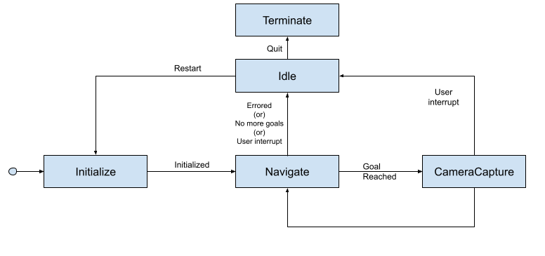

# turtlebot_fsm

This project has been developed and tested with Ubunutu 20.04 Focal and ROS1 Noetic.

Ideally, there shouldn't be any issues running with earlier versions, however steps to installing dependencies may differ.

### Overview

The following diagram shows a representation of the states and transitions implememnted in the Finite State Machine.

The FSM has been implemented using the [State Design](https://en.wikipedia.org/wiki/State_pattern) pattern. Each state is a [singleton](https://en.wikipedia.org/wiki/Singleton_pattern) object that can execute a behaviour and decide the transition to its successor state. The FSM holds a pointer to the current active state. A state's behaviour is executed when its `run()` method is trigerred. Each state can also implement behaviours to be run on entry and exit using the `init()` and `terminate()` methods.

### Install

		export CATKIN_WS=~/catkin_ws
		mkdir -p $CATKIN_WS/src
		cd $CATKIN_WS/src

		git clone https://github.com/athish-t/turtlebot_fsm.git
		cd $CATKIN_WS/src/turtlebot_fsm
		git submodule update --init --recursive

		rosdep install --from-paths . --ignore-src -r -y
		sudo apt install ros-noetic-amcl # not released in rosdep yet for noetic

		cd $CATKIN_WS
		catkin build turtle_bringup
		source $CATKIN_WS/devel/setup.bash

### Run

See `turtle_bringup/config` to configure navigation goals and the directory to save images.

		export TURTLEBOT3_MODEL=burger # only support burger
		roslaunch turtle_bringup sim.launch

To send user interrupt, publish a message:

		rostopic pub /interrupt std_msgs/Empty "{}"